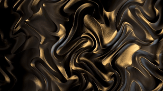
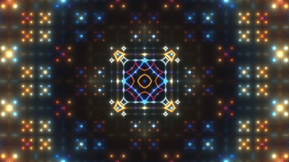

# Shader Gallery

A collection of examples built with the ESHI framework. All examples run in real-time on both CPU and GPU backends.

| Preview | Name | Description |
| :--- | :--- | :--- |
|  | **Warp** | A domain warping noise effect commonly used in clouds and terrain generation. Demonstrates `sampler2D` usage in CUDA. |
|  | **Deep Sea** | Volumetric lighting and raymarching simulating underwater caustic patterns. |
|  | **Fractal** | Iterative Mandelbulb/Julia set rendering showing high-precision floating point capabilities. |
|  | **Bubbles** | Particle system simulation demonstrating efficient distance field collisions. |
|  | **Neon** | Glow effects and post-processing bloom implementation. |
|  | **Raymarch** | Basic raymarching setup with soft shadows and ambient occlusion. |
|  | **Voronoi** | Cellular noise patterns used for organic textures. |
|  | **Starfield** | 3D projection of points simulating high-speed space travel. |

---
