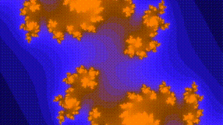
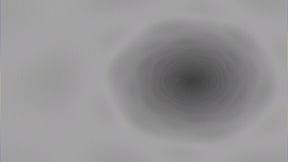
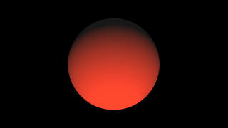
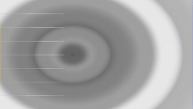
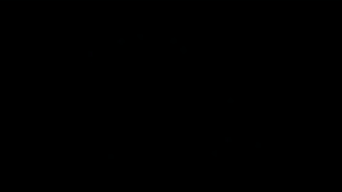
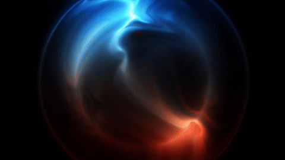
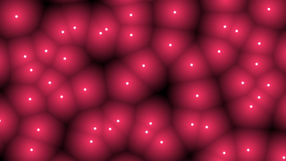
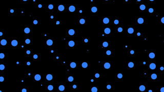

# Eshi 🧑‍🎨 (絵師)

**A high-performance, CPU-based shader engine and video generator.**

### 🖼️ Gallery
||||
|:---:|:---:|:---:|
| **Deep Sea**<br> | **Fractal**<br> | **Polar**<br> |
| **Raymarch**<br> | **Ripple**<br> | **Starfield**<br> |
| **Tzozen**<br> | **Voronoi**<br> | **Bubbles**<br> |

Eshi (Japanese for "painter" or "artist") is a minimal C++ framework that turns mathematical formulas into video. It allows you to write GLSL-style logic directly in C++, rendering procedural art to high-quality video files without needing a GPU pipeline or intermediate image sequences.

> *"Painting pixels with math."* 🥴🍹💫
>                -me
___

### 🎨 Origins & Credits
This project is heavily inspired by and builds upon the foundational concepts of **[Tzozen's](https://github.com/rexim/)** **[checker.c](https://gist.github.com/rexim/ef86bf70918034a5a57881456c0a0ccf)**.

While the original logic relied on generating raw **P6 Portable Pixmap (PPM)** files via standard output, **Eshi** evolves this concept by embedding the encoding pipeline directly into the application. Retaining the simplicity of the P6 pixel-stream philosophy but now with direct memory access and multi-threading for significantly higher performance. 

The goal for this silly little project would be to implement a small subset of code necessary to accept a simplified glsl function and produce either directly a video, or the raw P6 data. This of course has a lot of applications going forward, but I really liked his video on the topic and wanted to contribute something meaningful to the idea and give it my own spin :3 
___

### ✨ Features
* **Zero-IO Rendering:** Renders directly to H.264 (`.mp4`) in memory using linked FFmpeg libraries. No more generating thousands of `.ppm` files on disk.
* **CPU Shaders:** Includes a robust math library that emulates GLSL types (`vec2`, `vec4`) and intrinsics (`dot`, `mix`, `sin`, `swizzling`) in standard C++.
* **Embarrassingly Parallel:** Native **OpenMP** support automatically utilizes all available CPU cores to render frames in parallel.
* **Hot-Swappable Logic:** edit `shader.cpp` independently from the core engine.
___

### 🛠️ Build & Dependencies
Eshi requires `ffmpeg` development libraries and `OpenMP`.

**Dependencies (Debian):**
```bash
sudo apt install pkg-config libavcodec-dev libavformat-dev libavutil-dev libswscale-dev libomp-dev
make -f Makefile.linux_amd64 -j$(nproc)
```

**Dependencies (macOS, Intel):**
```bash
brew install libomp
make -f Makefile.macOS_amd64 -j$(getconf _NPROCESSORS_ONLN)
```
___

### 🚀 Usage
Define your art in ```shader.cpp``` using the ```mainImage``` function (Shadertoy style):
```C++
void mainImage(vec4 &fragColor, vec2 fragCoord, vec2 iResolution, float iTime) {
        vec2 uv = fragCoord / iResolution.xy;
        vec4 color = vec4(uv.x, uv.y, 0.5 + 0.5*sin(iTime), 1.0);
        fragColor = color;
}
```
___
## N.B.
The code is set to produce a video with 240 frames, you of course will be responsible
for adjusting that if you want anything different at this point.

The resulting binary will render an mp4 with the same name:
```bash
./deepsea
# > Using OpenMP with 12 cores.
# > Frame 240
# > Video saved.
```
## Examples
Build the examples with
```bash
make examples
# Creates: build/deepsea, build/fractal, etc...
```
___

### 🏛️ License
This project retains the MIT License of the original code.
___

### 📝 Finnaly 
З.Ы. Если вы дочитали до этого места, буду благодарен за звезду!
___

🥂 *За здоровье!*
