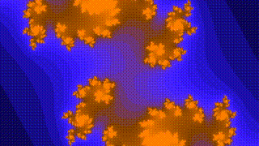
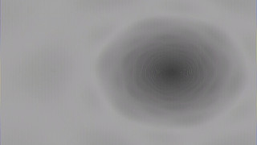
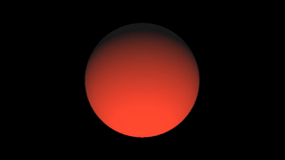
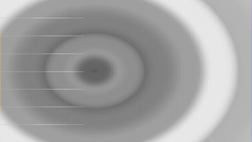
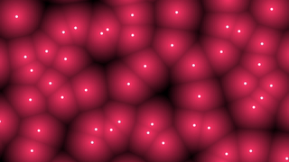

# Eshi 🧑‍🎨 (絵師)

**A high-performance, hybrid CPU/GPU shader engine and video generator.**

<p align="center">
<b>Warp</b><br>
</p>

### 🖼️ Showcase
||||
|:---:|:---:|:---:|
| **Aurora**<br> | **Deep Sea**<br> | **Fractal**<br> |
| **Polar**<br> | **Raymarch**<br> | **Ripple**<br> |
| **Starfield**<br> | **Tzozen**<br> | **Voronoi**<br> |
| **Bubbles**<br> | **Neon**<br> | **Seascape**<br> |


Eshi (Japanese for "painter" or "artist") is a minimal C++ framework that turns mathematical formulas into video. It allows you to write GLSL-style logic directly in C++, rendering procedural art to high-quality video files (`.mp4`) or a live window preview.

> *"Painting pixels with math."* 🥴🍹💫
>                -me
___

### 🎨 Origins & Credits
This project is heavily inspired by and builds upon the foundational concepts of **[Tzozen's](https://github.com/rexim/)** **[checker.c](https://gist.github.com/rexim/ef86bf70918034a5a57881456c0a0ccf)**.

Eshi evolves this concept by embedding the encoding pipeline directly into the application, supporting multi-threaded CPU rendering (OpenMP), GPU acceleration (CUDA & OpenGL), and live previews (SDL2).

___

### ✨ Features
* **Hybrid Rendering:** Seamlessly switch between **CPU (OpenMP)**, **GPU (CUDA/OpenGL)**, and **GPU (Metal)** rendering engines.
* **Live Preview:** Tweak your shaders in real-time with an SDL2 window (`--live`).
* **Zero-IO Video:** Renders directly to H.264 (`.mp4`) in memory using linked FFmpeg libraries.
* **Modern CLI:** Beautiful terminal UI powered by [Gum](https://github.com/charmbracelet/gum).
* **C++ Shaders:** A robust math library (`glsl_core.h`) that emulates GLSL types (`vec2`, `vec4`) and intrinsics in standard C++.
* **Zig Shader Examples:** Link Zig implementations into the CPU renderer while using portable GPU companions for accelerated rendering.
* **Arm64 Support:** Native compilation and hardware acceleration on Windows on Arm (Snapdragon) devices.

___

### 🛠️ Build & Dependencies

#### 🐧 Linux (Debian/Ubuntu/Arch)

**1. System Libraries:**
```bash
# Core Dependencies
sudo apt install pkg-config libavcodec-dev libavformat-dev libavutil-dev libswscale-dev libomp-dev libsdl2-dev

# Install Gum (for the CLI dashboard)
sudo mkdir -p /etc/apt/keyrings
curl -fsSL [https://repo.charm.sh/apt/gpg.key](https://repo.charm.sh/apt/gpg.key) | sudo gpg --dearmor -o /etc/apt/keyrings/charm.gpg
echo "deb [signed-by=/etc/apt/keyrings/charm.gpg] [https://repo.charm.sh/apt/](https://repo.charm.sh/apt/) * *" | sudo tee /etc/apt/sources.list.d/charm.list
sudo apt update && sudo apt install gum
```

**2. Fetch libsumi:**
```bash
./vendor.sh
# or: make vendor
```

If you are actively developing libsumi in a sibling checkout, skip vendoring and pass it directly:
```bash
make SUMI_PATH=../libsumi -j$(nproc)
```
By default, the Makefile uses `./libsumi` when it exists and falls back to `../libsumi` for local libsumi development.

**3. Compile:**
```bash
make -j$(nproc)
```
*(Note: If `nvcc` is found in your PATH, Eshi automatically compiles with CUDA support.)*

**Troubleshooting CUDA Paths:**
If the build fails with `/usr/bin/ld: cannot find -lcudart`, your CUDA installation may be in a non-standard location (common on Arch/CachyOS).
You can fix this by editing the `CUDA_PATH_LINUX` variable at the top of the `Makefile`, or by passing it directly to `make`:

```bash
# Example for Arch Linux / CachyOS
make CUDA_PATH_LINUX=/opt/cuda -j$(nproc)
```

#### 🍎 macOS (Homebrew)

**1. System Libraries:**
```bash
brew install pkg-config ffmpeg sdl2 sdl2_ttf libomp zlib bzip2 freetype
```

**2. Fetch libsumi:**
```bash
./vendor.sh
# or: make vendor
```

**3. Compile:**
```bash
make -j$(sysctl -n hw.ncpu)
```
The Makefile automatically prepends Homebrew `pkg-config` paths for keg-only and macOS shim dependencies such as `zlib` and `bzip2`.

The Makefile uses `zig c++` by default. (`zig cc` can infer C++ from a `.cpp`
input, but it does not select the C++ runtime when it performs the final link.)
You can still select another C++ compiler explicitly:

```bash
make CXX=clang++
```

#### Independent Zig build

The native Zig build graph produces the same main program and examples under
`zig-out/bin`:

```bash
# Everything, optimized with ReleaseFast by default
zig build

# Only one artifact
zig build eshi
zig build warp
zig build harlequin

# Useful overrides
zig build eshi -Doptimize=Debug -Dopenmp=false
zig build eshi -Dsumi-path=../libsumi
```

Both build paths use `pkg-config` for SDL2 and FFmpeg. On macOS, the Zig build
enables Metal and uses Homebrew's `libomp`; override a nonstandard installation
with `-Dlibomp-prefix=/path/to/libomp`.
Outside macOS the Zig build currently exercises the CPU/OpenMP path; CUDA
auto-detection remains in the Makefile path.

Shader examples may implement the CPU entry point in Zig. Because GPU drivers
cannot execute that host object directly, those examples provide a matching
portable GPU companion at `examples/gpu/<name>.cpp`. Eshi selects the companion
automatically for `--gpu`; the same source is consumed by Metal, OpenGL, and
CUDA backends. The `--gpu` flag does not generate or emit this `.cpp` file: the
companion is checked into the repository as shader source for GPU compilers.

For example, `harlequin` links `examples/harlequin.zig` for CPU rendering and
loads `examples/gpu/harlequin.cpp` when `--gpu` selects a GPU backend:

```bash
make build/harlequin
./build/harlequin --live --gpu
```

Zig 0.16 cannot use LTO for Mach-O: Zig requires LLD for LTO, while its LLD
backend cannot link Mach-O. Consequently, both Zig-based paths disable LTO on
macOS. `-fuse-ld=lld` does not work around this. On other platforms LTO remains
enabled by default; disable it with `make USE_LTO=0` or `zig build -Dlto=false`.

For isolated build/runtime benchmarks, use different prefixes so neither path
can reuse or overwrite the other's artifacts:

```bash
make BUILD_DIR=build-make -j$(sysctl -n hw.ncpu)
zig build -p build-zig

# Example with hyperfine installed; benchmark the same renderer and arguments.
hyperfine './build-make/warp --res 320x180' './build-zig/bin/warp --res 320x180'
```

For cold build-time measurements, also give each command a different
`ZIG_GLOBAL_CACHE_DIR`; separate output directories do not separate Zig's
compiler cache.

To remove Make outputs and Zig's default local artifacts (`.zig-cache` and
`zig-out`), run:

```bash
make clean
```

If you supplied custom `BUILD_DIR`, `ZIG_CACHE_DIR`, or `ZIG_OUT_DIR` values,
pass the same values to `make clean`.

#### 🪟 Windows (x64)

**1. Prerequisites:**
* **Visual Studio** (MSVC C++ Compiler)
* **CUDA Toolkit** (Must be installed and `nvcc` reachable)
* **[vcpkg](https://vcpkg.io/)** package manager

**2. Install Dependencies:**
Open a terminal in the project root and run:
```powershell
vcpkg install --triplet x64-windows
```

**3. Configure & Compile:**
1.  Open `build_all.bat` in a text editor.
2.  Update `VCPKG_ROOT` and `CUDA_PATH` variables.
3.  Run `build_all.bat`.

#### 🐲 Windows (Arm64 / Snapdragon)

**1. Prerequisites:**
* **Visual Studio 2022** (Ensure "ARM64 build tools" are installed)
* **[vcpkg](https://vcpkg.io/)** package manager
* **OpenCL™ and OpenGL® Compatibility Pack** (Install from Microsoft Store to enable Adreno GPU support)

**2. Install Dependencies:**
Open a terminal in the project root and run:
```powershell
vcpkg install --triplet arm64-windows
```

**3. Configure & Compile:**
1.  Open the **ARM64 Native Tools Command Prompt** for VS 2022.
2.  Open `build.arm64.bat` and update `VCPKG_ROOT`.
3.  Run the build script:
    ```cmd
    build.arm64.bat
    ```
4.  Executables will be generated in `build/`.

___

### 🚀 Usage

#### 1. The Interactive Dashboard (Recommended)
The easiest way to run demos is with the beautified shell script (Linux/WSL only currently):
```bash
./run_demos.sh
```
This launches a GUI-like menu in your terminal to select CPU/GPU modes and shows progress bars for renders.

#### 2. Manual CLI
You can also run the built binaries directly from the `build/` folder:

**Render to Video:**
```bash
# Linux
./build/deepsea
# Windows
.\build\deepsea.exe

# Output: deepsea.mp4 (in build/)
```

**Live Preview:**
```bash
./build/deepsea --live
# Opens a window. Press ESC to close.
```

**Options:**
* `--gpu`: Use hardware acceleration (CUDA on x64, OpenGL on Arm64).
* `--live`: Render to window instead of file.
* `--res WxH`: Set resolution (e.g., `--res 1920x1080`). Default is 960x540.

___

### 🧑‍💻 Writing Shaders
Define your art in `shader.cpp` using the `mainImage` function (Shadertoy style):
```cpp
void mainImage(vec4 &fragColor, vec2 fragCoord, vec2 iResolution, float iTime) {
    vec2 uv = fragCoord / iResolution.y;
    // ... your GLSL logic here ...
    fragColor = vec4(uv.x, uv.y, 0.5f + 0.5f*sinf(iTime), 1.0f);
}
```

Rebuild to update the binary.

___

### 🏛️ License
This project retains the MIT License of the original code.
___

### 📝 Finally 
З.Ы. Если вы дочитали до этого места, буду благодарен за звезду!
___

🥂 *За здоровье!*
